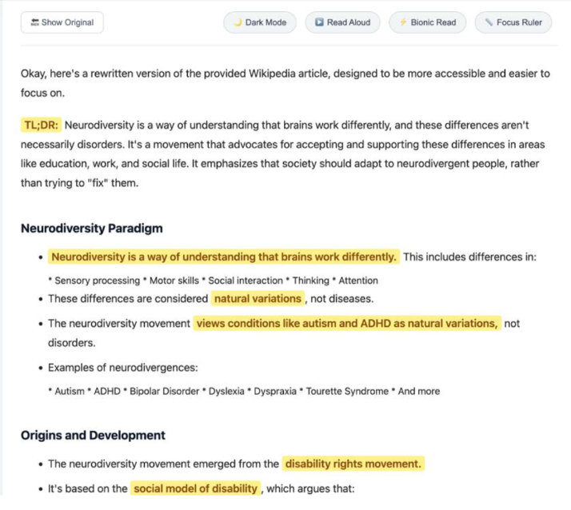

# CogniShift – AI-Powered Cognitive-Friendly Browser Extension

##  Overview

**CogniShift** is an AI-powered browser extension designed to create a **personalized, distraction-free, and cognitively accessible web experience**.

It intelligently transforms complex web content into simpler, more readable formats while highlighting key information — making it especially useful for **neurodiverse users** such as individuals with ADHD, dyslexia, and attention challenges.

This project demonstrates strong **real-world problem solving**, **AI-driven thinking**, and **modern browser extension development**.

---

##  Key Features

###  AI Content Simplification

* Converts complex paragraphs into easy-to-understand text
* Generates TL;DR summaries
* Highlights important lines automatically

###  Distraction-Free Mode

* Removes clutter, ads, and unnecessary elements
* Provides a clean and focused reading environment

###  Personalized Experience

* Enhances readability based on user needs
* Improves focus and reduces cognitive overload

###  Real-Time Processing

* Works instantly on any webpage
* No page reload required

###  Accessibility Support

* Designed for neurodiverse users
* Promotes inclusive and accessible web usage

---

## Tech Stack

* **JavaScript** (Core logic)
* **HTML & CSS** (UI design)
* **Chrome Extension APIs**

---

##  Project Structure

* `manifest.json` → Extension configuration
* `content.js` → Webpage content manipulation
* `background.js` → Background processing
* `popup.html / popup.js` → Extension interface
* `ai.js` → AI logic and processing
* `prompts.js` → Prompt handling

---

##  Installation Guide

1. Open Chrome → Extensions
2. Enable **Developer Mode**
3. Click **Load Unpacked**
4. Select this project folder
5. Activate the extension

---

##  Demo / Screenshots

###  AI-Enhanced Content View

 The extension simplifies content, highlights key insights, and improves readability in real-time.

---

##  Real-World Impact

CogniShift helps:

* Reduce cognitive overload
* Improve reading comprehension
* Support neurodiverse users
* Enhance productivity and focus

---

##  Future Enhancements

* AI-powered summarization
* Voice-based reading assistant
* Multi-language support
* Personalized learning assistant

---

##  What Makes This Project Special

* Solves a **real-world accessibility problem**
* Combines **AI + Web Development**
* Focuses on **user experience and inclusivity**
* Demonstrates **practical system design thinking**

---

##  Author

**Anwesha Sharma**
 (GROUP_PROJECT)
